 
## 查看主页获取源码

> **作者介绍**： **✌**全网粉丝10W+本平台特邀作者、博客专家、CSDN新星计划导师、java领域优质创作者,博客之星、掘金/华为云/阿里云/InfoQ等平台优质作者、专注于项目实战 **✌**

  

### 一、作品包含

源码+数据库+设计文档万字+PPT+全套环境和工具资源+部署教程

### 二、项目技术

前端技术：Html、Css、Js、Vue、Element-ui

数据库：MySQL

后端技术：Java、Spring Boot、MyBatis

  

### 三、运行环境

开发工具：IDEA/eclipse

数据库：MySQL5.7

数据库管理工具：Navicat10以上版本

环境配置软件： JDK1.8+Maven3.6.3

前端Nodejs：14

### 四、项目介绍
项目编号：springbootA096

大学生二手电子产品交易平台是一个专为高校学生设计的在线市场，旨在提供一个安全、便捷的环境，让学生可以买卖二手电子产品，如手机、电脑、平板等，从而实现资源再利用，减少浪费，同时也帮助学生节省开支，提高物品的使用价值。

它分为前台和后台两个部分。

前台包括浏览首页、二手商品、公告活动、后台管理、购物车和个人中心等功能模块。这些模块为用户提供浏览、购买和管理二手电子产品的界面。
后台模块，平台下设有管理员和用户两个子模块。管理员模块进一步细分为首页、个人中心、用户管理、商品分类管理、二手商品管理、在线咨询管理、系统管理和订单管理等功能。而用户模块则包括首页、个人中心、二手商品管理、在线咨询管理和订单管理等功能。

### 五、运行截图

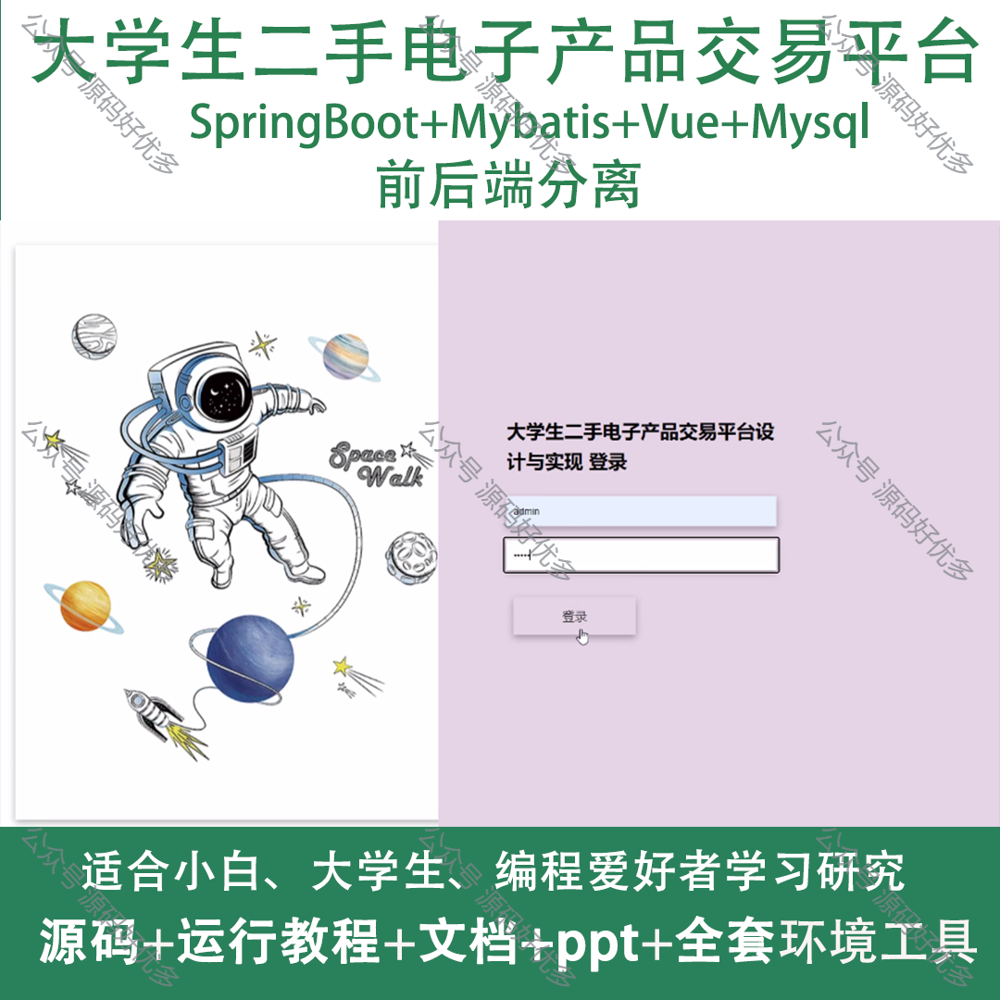
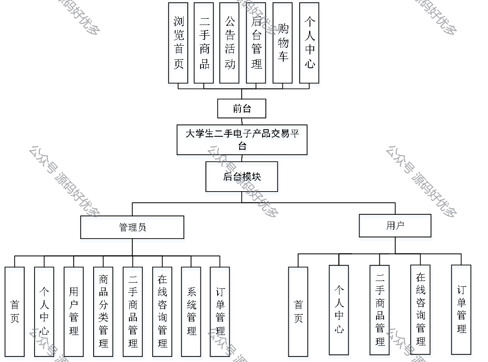
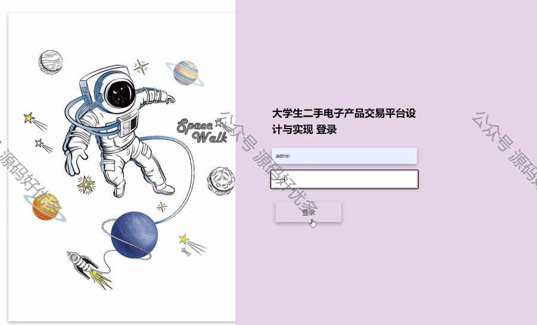
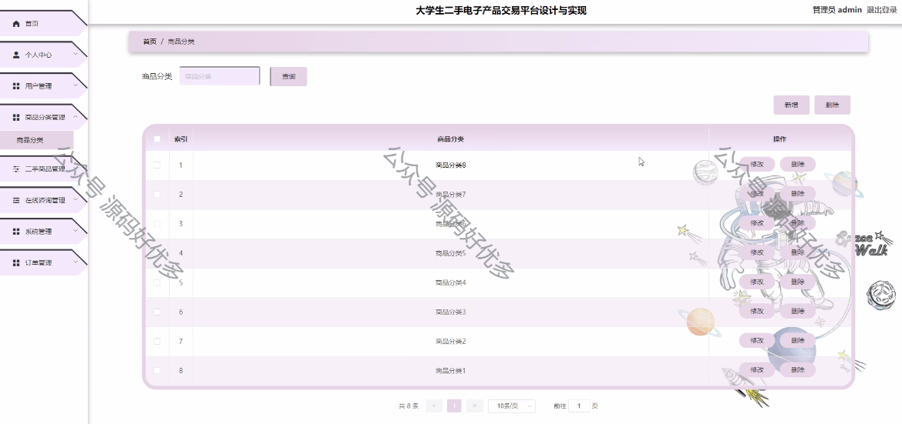
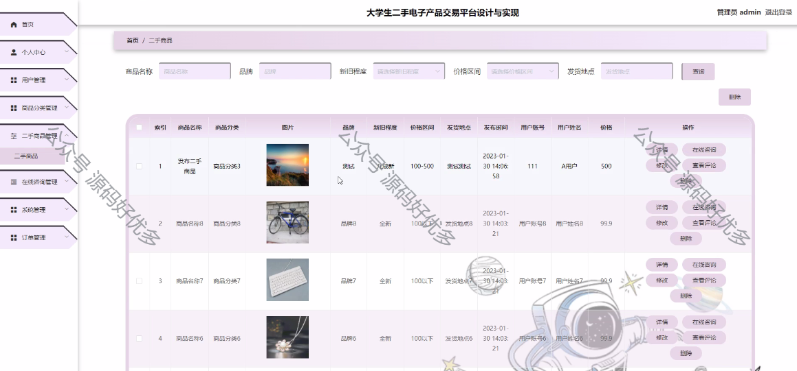
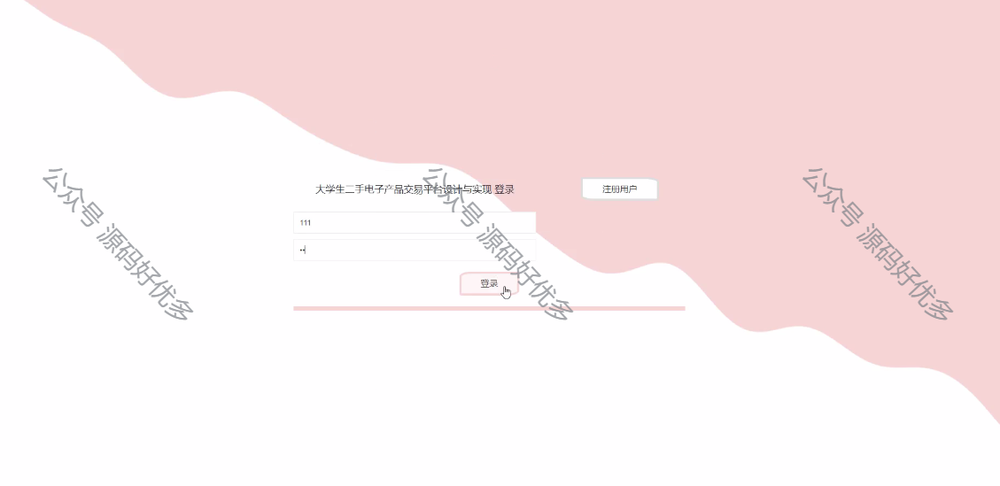
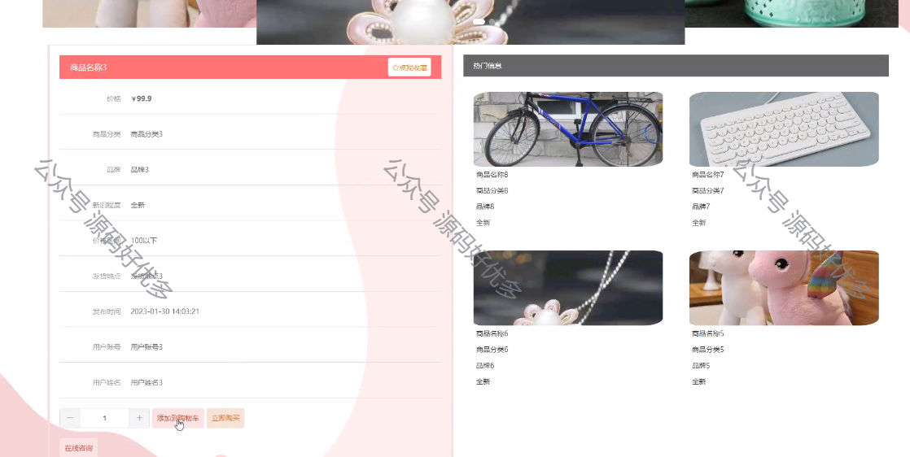
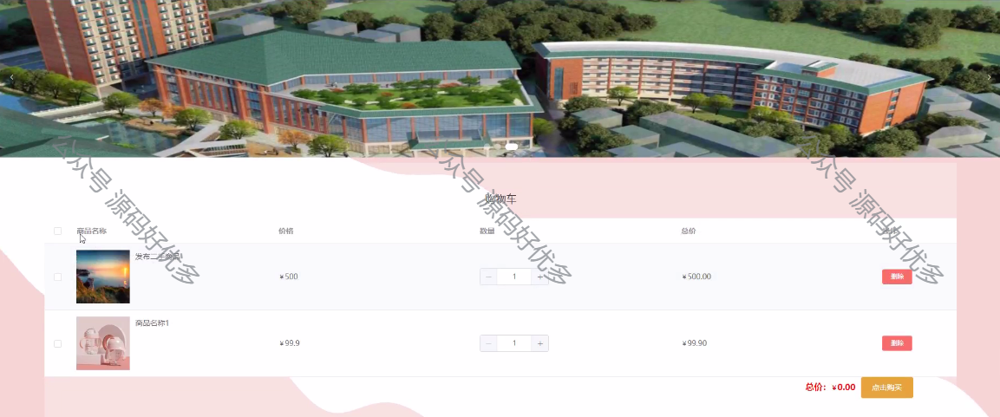
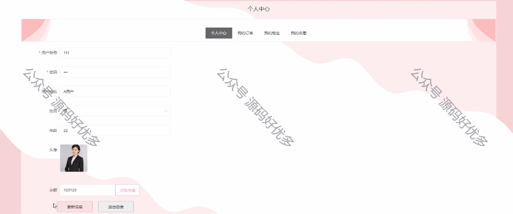
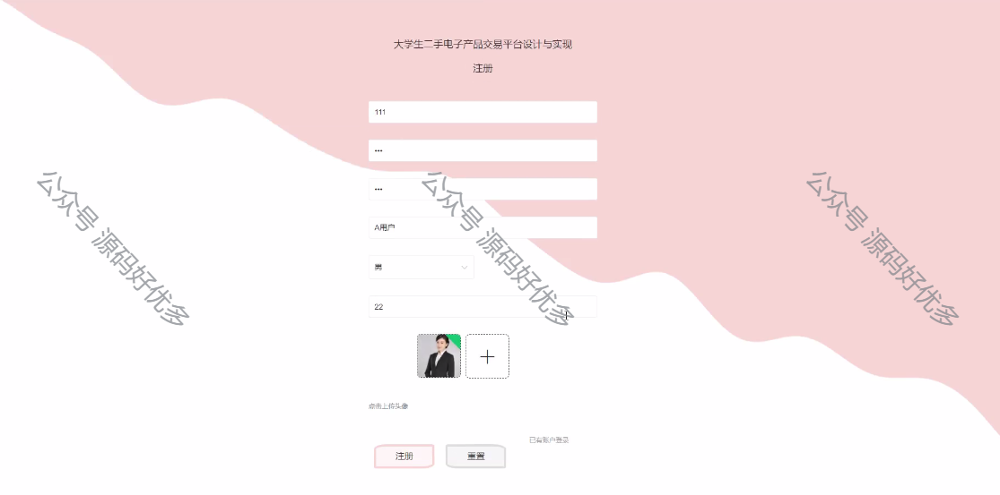
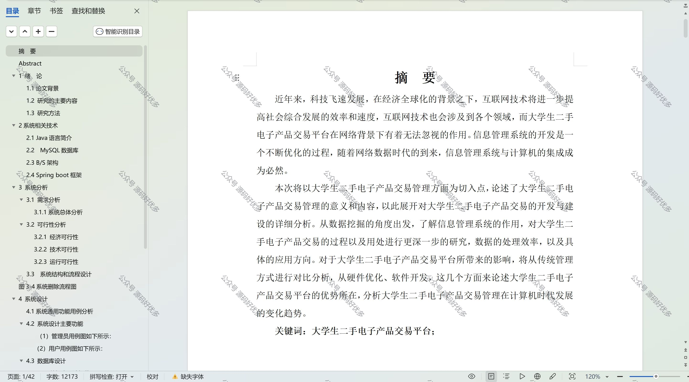

  
